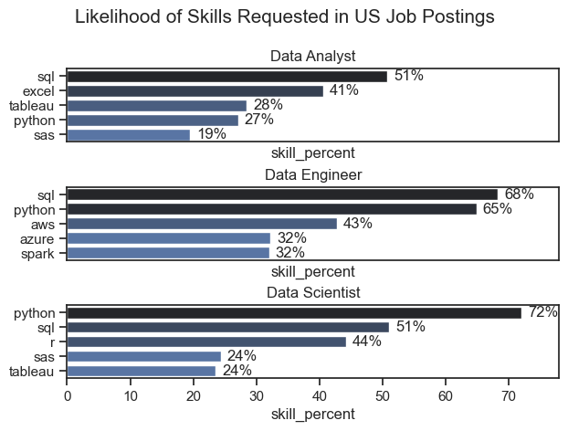
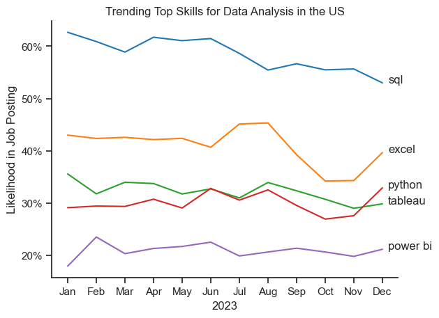
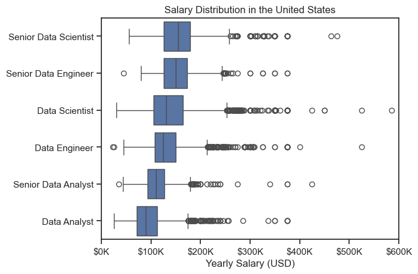
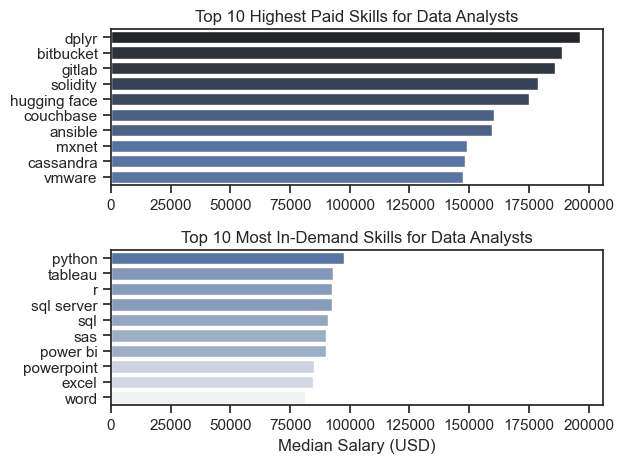

# Overview

Welcome to my analysis of the data job market, focusing on data analyst roles. This project was created out of a desire to navigate and understand the job market more effectively. It delves into the top-paying and in-demand skills to help find optimal job opportunities for data analysts.

The data sourced from Luke Barousse's Python Course which provides a foundational for my analysis, containing detailed information on job titles,salaries,locations and essential skills. Through a series of Python scripts, I explore key questions such as the most demanded skills,salary trends, and the intersection of demand and salary in data analytics.

# The Questions

Below are the Questions I want to answer in my project:
1. What are the skills most in  demand for the top 3 most popular data roles?
2. How are in-demand skills trending for Data Analysts?
3. How well do jobs and skills pay for Data Analysts?
4. What are the optimal skills for data analysts to learn?(High Demand and High Paying)

# Tools I Used
For my deep dive into the data analyst job market, I harnessed the power of several key tools

- Python: The backbone of my analysis, allowing me to analyze the data and giving critical insights. I also use the following Python libraries:
    - Pandas Library: This was used to analyze the data.
    - Matplotlib Library: I visualize the data.
    - Seaborn Library: Helped me create more advanced visuals.

- Jupyter Notebooks: The tool I used to run my Python scripts which let me easilty include my notes and analysis.
- Visual Studio Code: My go-to for executinh my Python scripts
- Git & Github - Essential for versionn control and sharing my Python code and analysis, ensuring collaboration

# Data Preparation and Cleanup

This section outlines the steps taken to prepare the data for analysis, ensuring accuracy and usability.All preprocessing was performed using pandas within Jupyter Notebooks in Visual Studio Code.

#### 1. Data Loading
- Imported the dataset directly from Hugging Face using `datasets.load_dataset('lukebarousse/data_jobs')`.
- Converted the Hugging Face dataset to a standard pandas DataFrame using `.to_pandas()`.

#### 2. Data Type Conversion
- **Date Formatting**: Converted the `job_posted_date` column from string objects to `datetime` objects using `pd.to_datetime()`. This enables time-series analysis and date-based filtering.
  ```python
  df['job_posted_date'] = pd.to_datetime(df['job_posted_date'])   


# The Analysis

## 1. What are the most demanded skills for the Top 3 most     popular data roles?

To find the most demanded skills for the top 3 most popular data roles.
 I filtered out those postions by which ones were the most popular, and got the top skills for these top 3 roles. Thhis query highlights the most popular job titles and their top skills, showing which skills I should pay attention to depending on the role I'm targeting.

View my notebook with detailed steps here:
[2_Skills_Count.ipynb](2_Project/2_Skills_Count.ipynb)

### Visualize Data
```python
fig, ax = plt.subplots(len(job_titles), 1)

for i,job_title in enumerate(job_titles):
    df_plot = df_skills_perc[df_skills_perc['job_titles_short'] 
    == job_title].head(5)[::-1]
    sns.barplot(data=df_plot, x='skill_percent',y='job_skills',ax=ax[i],
    hue='skill_count',palette='dark:b_r')
plt.show()
```

### Results



### Insights

- Python is a versatile skill, highly demanded across all three roles, but most prominently for Data Scientists (72%) and Data Engineers (65%).
-SQL is the most requested skill for Data Analysts and Data Scientists, with it in over half the job postings for both roles. For Data Engineers, Python is the most sought-after skill, appearing in 68% of job postings.
-Data Engineers require more specialized technical skills (AWS, Azure Spark)compared to Data Analysts and Data Scientists who are expected to be proficient in more general data management and analysis tools(Excel, Tableau)

# The Analysis

## 2. How are in-demand skills trending for Data Analysts?

### Visualize Data

```python
from matplotlib.ticker import PercentFormatter

df_plot = df_DA_US_percent.iloc[:,:5]
sns.lineplot(data=df_plot, dashes=False, legend='full',palette='tab10')
plt.gca().yaxis.set_major_formatter(PercentFormatter(decimals=0))

plt.show()

```

### Results


*Bar graph visualizing the trending top skills for data analysts in the US in 2023.*

# 
- SQL remains the most consistently demanded skill throughout the year, although it shows a gradual decrease in demand.
- Excel expereienced a significant increase in demand starting around September, surpassing both Python and Tableau by the end of the year.
- Both Python and Tableau show relatively stable demand throughout the year with some fluctuations but remain essential skills for data analysts. Power BI, while less demanded compared to the others, shows a slight upward trend towards the year's end.


# The Analyis

## 3. How well do jobs and skills pay for Data Analysts?

### Salary Analysis for Data Nerds

```python
sns.boxplot(data=df_US_top6, x='salary_year_avg',y='job_title_short', order = job_order)

ticks_x = plt.FuncFormatter(lambda y, pos: f'${int(y/1000)}K')
plt.gca().xaxis.set_major_formatter(ticks_x)
plt.show()
```

#### Results

*Box plot visualizing the salary distributions for top 6 data job titles.*

#### Insights
- There's a significant variatiob in salary ranges across different job titless. Senior Data Scientist positions tend to have the highest salary potential, with upto $600K, indicating the high value placed on advanced data skills and experience in the industry.

- Senior Data Engineer and Senior Data Scientist roles show a considerable number of outliers on the higher end of the salalry spectrum, suggesting that exceptional skills or circumstance can lead to high pay in these roles. In contrast, Data Analyst roles demonstrates more consistency in salary, with fewer outliers.

- The median salaries increase with the seniority and specialization of the roles. Senior roles (Senior Data Scientist, Senior Data Engineer) not only have higher median salaries but also larger diffrences in typical salaries, reflecting greater variance in compensation as responsibilities increase.

#### Visualize Data
```python

fig, ax = plt.subplots(2,1)
#df_DA_top_pay[::-1].plot(kind='barh',y='median', ax=ax[0], legend=False)
sns.barplot(data=df_DA_top_pay,x='median',y=df_DA_top_pay.index,ax=ax[0],hue='median',palette='dark:b_r')
sns.set_theme(style='ticks')
ax[0].set_title('Top 10 Highest Paid Skills for Data Analysts')
ax[0].legend_.remove()
ax[0].set_ylabel('')
ax[0].set_xlabel('')


#df_DA_skills[::-1].plot(kind='barh',y='median', ax = ax[1], legend=False)
sns.barplot(data = df_DA_skills,x = 'median', y=df_DA_skills.index,ax=ax[1],hue='median',palette='light:b')
sns.set_theme(style='ticks')
ax[1].set_title('Top 10 Most In-Demand Skills for Data Analysts')
ax[1].legend_.remove()
ax[1].set_ylabel('')
ax[1].set_xlabel('Median Salary (USD)')
ax[1].set_xlim(ax[0].get_xlim())
plt.tight_layout()
```

*Two separate bar graphs visualizing the highest paid skills and most in-demand skills for data analysts in the US.*

### Insights
- The top graph shows specialized technical skills like `dplyr`,`Bitbucket`, and `Gitlab` are associated with higher salaries, some reaching up to $200K, suggesting that advanced technical proficiency can increase earning potential.
- The bottom graph highlights that foundational skills like `Excel`,`Powerpoint`, and `SQL` are the most in-demand, even though they may not offer the highest salaries. This demonstrates the importance of these core skills for employability in data analysis roles.
- There's a clear distinction between the skills that are highest paid and those that are most in-demand. Data analysts aiming to maximize their career potential should consider developing a diverse skill set that includes both high-paying specialized skills and widely demanded foundational skills.

# The Analysis
## 4. What is the most optimal skill to learn for Data Analysts?

#### Visualize Data
````python
from adjustText import adjust_text
import matplotlib.pyplot as plt

plt.scatter(df_DA_skills_high_demand
['skill_percent'], df_DA_skills_high_demand['median_salary'])
plt.show()
````

#### Insights

- The scatter plot shows that most of the `programming` skills (colored blue) tend to cluster at higher salary levels compared to to other categories, indicating that programming expertise might offer greater salary benefits within the data analysis field.

- Analyst tools(colored green), including Tableau and Power BI, are prevalent in job psotings and offer competitive salaries, showing that visualization and data analysis software are crucial for current data roles. This category not only has good salaries but is also versatile across different types of data tasks.

- The database skills (colored orange), such as Oracle and SQL Server, are associated with some of the highest salaries among data analyst tools. This indicates a significant demand and valuation for data management and manipulation expertise in the industry.

# What I Learned

Throughout this project, I deepeened my understanding of the data analyst job market and enhanced my technicak skills in Python, especially in data manipulation and visualization. Here are a few specific things I learned:

- `advanced Python Usage`: Utilizing libraries such as Pandas for data manipulation, Seaborn and Matplotlib for data visualization, and other libraries helped me perform complex data analysis tasks more efficiently.
- `Data Cleaning Importance`: I learned that thorough data cleaning and Preparation are crucial before any analysis can be conducted, ensuring the accuracyof insights derived from data.
- `Strategic Skill Analyis`: The project emphasized the importance of aligning one's skills with market demand. Understanding the relationship between skill demand, salary and job availability allows for more Strategic career planning in the tech industry.

#### Insights

This project provided several general insights into the data job market for analysts:

- `Skill Demand and Salary Correlation`: There is a clear Correlation between the demand for specific skills and the salaries these skills command. Advcanced and specialized skills like Python and Oracle often lead to higher salaries.
- `Market Trends`: There are changing trends in skill demand, highlighting the dynamic nature of the data job market. Keeping up with these trends is essential for career growth in data analytics.
- `Economic Value of Skills`: Understanding which skills are both in-demand and well-compensated can guide data analysts in prioritizing learning to maximize their economic returns.

# Challenges I Faced

This project was not without its Challenges, but it provided good learning opportunities:

- `Data Inconsistencies`: Handling missing or inconsistent data entries requires careful consideration and thorough techniques to ensure integrity of the analysis.
- `Complex Data Visualization`: Designing effective visual representatiobs of complex datasets, conveying insights clearly and compellingly.
- `Balancing Breadth and Depth`: Deciding how deeply to dive into each analysis while maintaining abroad Overview landscape required constant Balancing to ensure comprehensive coverage without getting lost in details.

# Conclusion
This exploration into the data analyst job market has been incredible informative, highlighting the critical skills and trends that shape this evolving field. 
The insights I got enhance my undertanding and provide actionable guidance for anyone looking to advance their career un data analytics. 
As the market continues to change, ongoing analysis will be essential to stay ahead in data analytics. 
This project is a good foundation for future explorations and underscores the importance of continuous learning abd adaptation in the data field. 


